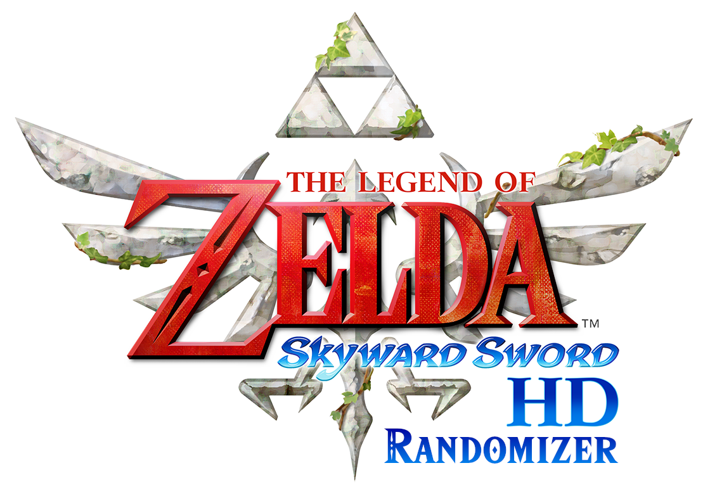

  

  
  

<h2 align="center">
  <a href="https://github.com/mint-choc-chip-skyblade/sshd-rando/releases">🎲 Download the latest version of the Randomizer here! 🎲</a>
</h2>

# What is Legend of Zelda: Skyward Sword HD Randomizer?

Skyward Sword HD Randomizer (SSHDR) is a mod for Skyward Sword HD that randomly shuffles all the items from chests, quests and loose pickups around with each other. This enables for near infinite replayability, with players having to adapt to what they find on the fly!

The randomizer shuffles items following a set of logic which ensures that, without tricks or glitches, every seed is logically beatable in the intended way.

https://github.com/mint-choc-chip-skyblade/sshd-rando/assets/9409276/de6798b4-ef9b-42aa-acee-743186b8cdbe

<table>
  <tr>
    <th><a href="#️-pre-requisites">Setup & Guides</a></th>
    <th><a href="./docs/developing.md">Running from Source</a></th>
  <tr>
  <tbody>
  <tr>
    <td width="1200" align="center" valign="top">
      
    </td>
     <td width="1200" align="center" valign="top">
      
    </td>
  </tbody>
</table>

### Contents

- [Download](https://github.com/mint-choc-chip-skyblade/sshd-rando/releases)
- [Setup](#️-pre-requisites)
  - [Running from Source](./docs/developing.md)
- [FAQ](#️-frequently-asked-questions-faq)
- [Shoutouts](#-shoutouts)

## ❗️ Pre-requisites

You will need these before you can play SSHDR!

* A homebrewed Nintendo Switch console that you will use to extract your game files
* Your copy of The Legend of Zelda: Skyward Sword HD (digital or physical)
* A way to play the game (console or emulator)
* [This randomizer!](https://github.com/mint-choc-chip-skyblade/sshd-rando/releases)

## 💡 Setup Guide

### Emulator or Console

* [🖥️ Get going with our **Emulator** Setup Guide!](https://docs.google.com/document/d/1HHQRXND0n-ZrmhEl4eXjzMANQ-xHK3pKKXPQqSbwXwY)
* [🎮 Or our **Console** Setup Guide!](https://docs.google.com/document/d/1VXNME7SVD5EU7NNn9dQ15_Q9-v9OJAHOX-hSor0n2dg)

### Tips & Tricks

* [🗺️ Don't get lost with our Location Guide!](https://docs.google.com/document/d/1bb6GoCBFVREc-wHscRBTfZrftN1OA639iML2azdXqXE)
* [🪄 Learn cool techniques with our Tricks Guide!](https://docs.google.com/document/d/1Dm0jhwXWIvPLuvl-JoRqocTKjXM_jRRmryYqpQMO_6w)

### Socalize

* [💬 Join our Discord Server!](https://discord.gg/nNbpfH5jyG)

## 🗂️ Frequently Asked Questions (FAQ)

> ### "Does this work on a Nintendo Switch console?"

Yep!

> ### "Does this work on an emulator?"

Yep!

> ### "What are all these acronyms about (SSR, SSHDR, SDR, HDR)?"

Broadly, these are all different terms for the 2 randomizers for Skyward Sword:

* `SSR` = **Skyward Sword Randomizer**. This usually refers to the randomizer for the Wii version of the
game.
* `SSHDR` = **Skyward Sword HD Randomizer**. This is us! The randomizer for the Switch version of the
game.
* `SDR` = **Standard Definition (SD) Randomizer**. This refers to the randomizer for the Wii (or "SD")
version of the game.
* `HDR` = **High Definition (HD) Randomizer**. This refers to the randomizer for the Switch (or "HD")
version of the game.

> ### "What is different from the Wii version (SDR)?"

In short, _**a lot!**_

Due to the better hardware that the Nintendo Switch has, we have been able to add a ton of
features that can't be easily achieved in the Wii version. There are also changes that we
have made because the decisions made by the SDR devs (some of us are *also* devs there) don't work as well when applied to HDR.

[📋 You can find the full list of differences here!](https://github.com/mint-choc-chip-skyblade/sshd-rando/blob/main/docs/differences_between_hdr_and_sdr.md)

## 📣 Shoutouts

### Contributors

All the amazing people who have directly contributed to this project can be found here - check them out!

### Beta Testers

All our lovely beta testers who found countless bugs and issues!

### Additional Callouts

* Everyone who has helped create community resources such as the setup guides, the locations guide, and the tricks guide!
* All the people who have added to the cumulative knowledge of Skyward Sword as a game through reverse engineering and modding - this project couldn't have advanced anywhere near as quickly without their work!
* The developers of [The Legend of Zelda: Skyward Sword Randomizer](https://github.com/ssrando/ssrando) for the Nintendo Wii!
